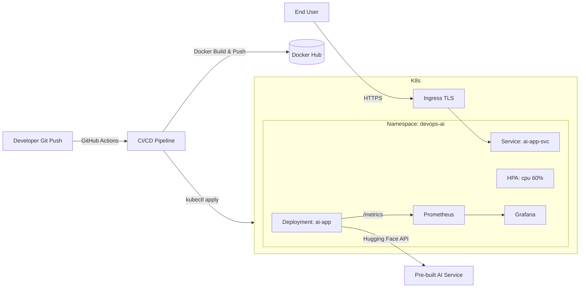

# DevOps AI Web App — Scalable, Monitored, Secure (Fast-Track)

This repository implements the technical assessment end‑to‑end in a **fast-track 2‑hour** build that still meets all the required deliverables:

- Cloud-ready containerized **AI web application** (Flask) that calls a **pre‑built AI service** (Hugging Face Inference API).
- **Docker** image and **Kubernetes** manifests (Deployment, Service, HPA, Ingress).
- **CI/CD** with GitHub Actions (test → build → push → deploy).
- **Monitoring** with Prometheus & Grafana; app exposes **/metrics** (Prometheus format).
- **Security**: TLS via cert‑manager (Let’s Encrypt), non‑root container, resource limits, probes.
- **Disaster Recovery**: simple plan + sample commands (snapshots and manifest re‑apply).

> **Note**: Replace placeholders like `YOUR_DOMAIN_HERE`, `you@example.com`, and set secrets in GitHub and Kubernetes as shown below.

---

## 1) Architecture



**Scalability:** HPA (CPU 60%), stateless app, multiple replicas, external AI service.  
**High Availability:** 2+ replicas, readiness/liveness probes, rolling updates via CI/CD.  
**Security:** TLS with cert‑manager, non‑root user, least-privilege secrets, SG/NACL at cloud level.  

---

## 2) Cloud Infrastructure (Day 1 condense)

- **AWS** (fast path): Create an **EKS** cluster with managed node group (or start with **K3s/Kind/Minikube** for demo).
- Make sure `kubectl` contexts are set and NGINX ingress is installed.

### Quickstart (local or any cluster)
```bash
# 1) Build and run locally
docker build -t devops-ai-app:local .
docker run -p 8000:8000 --rm -e HUGGINGFACE_API_TOKEN=... devops-ai-app:local

# 2) Deploy to Kubernetes (after adjusting IMAGE_PLACEHOLDER or via CI)
export HUGGINGFACE_API_TOKEN=YOUR_TOKEN
./scripts/setup.sh
```

**API Contract**
```
POST /predict
{ "text": "Your long text...", "task": "summarization" }

200 OK -> { "result": [...], "elapsed_seconds": 1.23 }
```

---

## 3) Containerization (Docker)

- Dockerfile uses `python:3.11-slim`, installs minimal deps, runs **gunicorn** as **non-root** user.
- Exposes port **8000**.

---

## 4) Kubernetes Manifests

- `deployment.yaml` includes 2 replicas, probes, resource limits, and env vars.
- `service.yaml` exposes ClusterIP, with Prometheus scrape annotations.
- `hpa.yaml` adds autoscaling.
- `ingress.yaml` uses NGINX + cert‑manager for TLS.

Create secrets:
```bash
kubectl -n devops-ai create secret generic ai-secrets \
  --from-literal=hf_api_token=YOUR_HF_TOKEN
```

Replace the image (if deploying manually without CI):
```bash
sed -i 's|IMAGE_PLACEHOLDER|docker.io/<yourusername>/devops-ai-app:latest|g' kubernetes/deployment.yaml
```

---

## 5) CI/CD (GitHub Actions)

Pipeline stages:
1. **Test:** `pytest` runs unit tests.
2. **Build & Push:** Docker image pushed to Docker Hub.
3. **Deploy:** Applies K8s manifests to the cluster using `KUBE_CONFIG` secret.

**Required GitHub Secrets:**
- `DOCKERHUB_USERNAME`, `DOCKERHUB_TOKEN`
- `KUBE_CONFIG` (base64 kubeconfig or raw yaml)
- Optional: `HUGGINGFACE_API_TOKEN` if you build tests requiring live calls (we mock by default).

---

## 6) Monitoring (Prometheus & Grafana)

- App exposes Prometheus metrics at `/metrics` using `prometheus-client`.
- `service.yaml` includes scrape annotations.
- Manifests for **Prometheus** (`prometheus.yaml`) and **Grafana** (`grafana.yaml`) in `kubernetes/monitoring/`.

Expose locally:
```bash
kubectl -n devops-ai port-forward svc/prometheus-svc 9090:9090
kubectl -n devops-ai port-forward svc/grafana-svc 3000:3000
# Grafana login: admin / set via secret (default in setup.sh: admin123)
# Add Prometheus datasource: http://prometheus-svc.devops-ai.svc.cluster.local:9090
```

Suggested Grafana panels:
- `rate(app_requests_total[1m])` by endpoint & status
- `histogram_quantile(0.95, sum(rate(app_request_latency_seconds_bucket[5m])) by (le, endpoint))`
- `histogram_quantile(0.95, sum(rate(app_inference_latency_seconds_bucket[5m])) by (le))`

---

## 7) Security

- **TLS** via cert‑manager issuer (`kubernetes/cert-manager/cluster-issuer.yaml`) + `ingress.yaml`.
- Non‑root container user, explicit resource requests/limits, liveness/readiness probes.
- Keep secrets in **K8s Secrets** and restrict RBAC & network policies (add as needed).
- On cloud: restrict inbound with Security Groups; enable AWS Shield/WAF for public ingress where applicable.

---

## 8) Disaster Recovery

**Objective:** Restore service rapidly after app/node/cluster issue.

- **Stateless app** → redeploy from Git + container registry.
- **Cluster objects** → stored in Git (`kubernetes/*.yaml`), re‑apply with `kubectl apply -f`.
- **Backups:**
  - Create **etcd/cluster snapshots** (managed in EKS control plane) or use **Velero** for backups.
  - Store Docker images in external registry (Docker Hub/GHCR).
- **Runbook:**
  1. Scale replicas to 0 (cordon node if needed).
  2. Recreate Deployment & Service: `kubectl rollout restart deploy/ai-app -n devops-ai`.
  3. If registry/image failure, switch tag to last known good: edit Deployment image.
  4. Validate `/healthz`, then traffic via Ingress.
- **Simulation:** Kill pod (`kubectl delete pod ...`) and confirm HPA/Deployment self-heals.

---

## 9) Local Testing

```bash
curl -X POST http://localhost:8000/predict \
  -H "Content-Type: application/json" \
  -d '{"text":"This is a long article...", "task":"summarization"}'

curl http://localhost:8000/metrics
```

---

## 10) Version Control Best Practices

- `main` protected branch, PRs with required checks.
- Conventional commits, semantic version tags for images.
- Store manifests and scripts in repo, avoid committing secrets.

---

## 11) Notes & Alternatives

- Use **AWS ALB Ingress Controller** on EKS if preferred.
- Use **Karpenter/Cluster Autoscaler** for node scaling.
- Replace Hugging Face endpoint with any pre-built AI API (OpenAI, Cohere, etc.).

---

### Clean Up
```bash
kubectl delete ns devops-ai
```

---

**Authoring Checklist (assessment mapping):**
- Cloud infra + containerization ✅
- AI app integration ✅
- Kubernetes deploy + autoscaling ✅
- CI/CD GitHub Actions ✅
- Monitoring (Prom + Graf) ✅
- Security (TLS, non-root, limits) ✅
- DR plan + simulation steps ✅
- Documentation + diagram ✅
